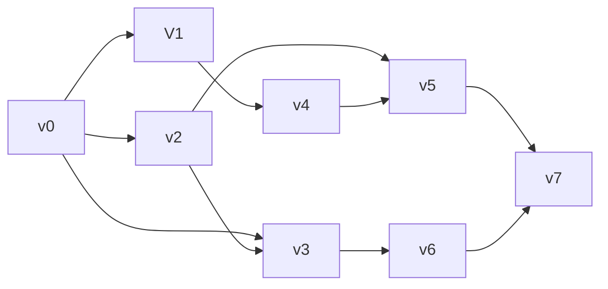

## $$面向考试的学习$$

### $线性表$

线性表（$List$）的定义：零个或多个数据元素的**有限**序列。

​	线性表的数据集合为$\{a_1,a_2……a_n\}$，该序列有唯一的头元素和尾元素，除了头元素外，每个元素都有唯一的前驱元素，除了尾元素外，每个元素都有唯一的后继元素。

线性表有

**顺序存储结构**——顺序表：地址连续

**链式存储结构**——链表：地址可连续可不连续

​	线性表中的元素属于相同的数据类型，即每个元素所占的空间相同。

​	注意：$Python$中的$List$存储的是引用，所以尽管数据类型多样，$List$中数据类型仍相同

生成、求表中元素个数、表尾添加/删除元素、返回/修改对应下标元素，均为$O(1)$；

而查找、删除、插入元素，均为$O(n)$。

**循环队列****/****环形队列**

环形队列是开一个固定大小的空间，然后如果后面空间被完全占用就往前面放的队列；而一般队列出队

之后前面的空间无法重复利用——空间仍然占用，只是头指针向后移动。


### **散列表**

散列表，其映射方法也即 hash （哈希），是利用函数映射将 key 映射到数组索引、再用索引得到地址

addr 的方法——也就是散列存储结构。其要点在于：(1) 如何构造散列函数；(2) 如何处理冲突

构造散列函数(似乎不太重要)：数字分析法；平方取中法；折叠法；除留余数法。**除留余数法是最常用**

**的**。

处理冲突：

​			1. **开放地址法**：冲突之后利用合适方法计算不断得到新的地址（准确来说这里地址指的是索引），直到不冲突。 new_h = (h(key) + d_i) % m

​						线性探测法：d_i取1,2,3,...

​						二次探测法：d_i = ±1**2 ， ±2**2 ，...

​						伪随机探测法：d_i 从伪随机数序列中取

​						**双散列法**： h1(key) **得到** hash_value **，如果这个位置为空就插入；否则，用** h2(key) **得** **到** step **，不断跳过** step **个位置直到遇到空位****——****注意** h2 **是对** key **执行而不是对** h1 **得到的**hash_value **执行。**

2. **链地址法**：把地址冲突的元素记录在一个单链表中，散列表相当于一个（散列）桶。


### $链表$

##### 1、单链表

​	在链式结构中，除了要存储数据元素的信息外，还要存储它的后继元素的存储地址。存储数据元素信息的域称为数据域，存储直接后继位置的域称为指针域。指针域中存储的信息称做指针或链。

​	链表中第一个结点的存储位置叫做头指针。有时为了方便对对链表进行操作，会在单链表的第一个结点前附设一个节点，称为头结点，此时头指针指向的结点就是头结点。

​	空链表，头结点的直接后继为空。

##### 2、双链表

​	双向链表$$(Double$$ $$Linked$$ $$List)$$是在单链表的每个结点中，再设置一个指向其前驱结点的指针域。所以在双向链表中的结点都有两个指针域，一个指向直接后继，另一个指向直接前驱。

##### 3、循环链表

​	将单链表中终端节点的指针端由空指针改为指向头结点，就使整个单链表形成一个环，这种头尾相接的单链表称为单循环链表，简称循环链表。


### $堆$

定义：分大顶堆和小顶堆，同样是递归定义。以小顶堆为例——根节点是所有节点中最小的

实现方式：按完全二叉树的顺序存储方式把元素存储在一个一维数组中，满足根节点值大于（小于）所有子节点值

初始化：对分支节点从下往上依次向下冒泡调整，时间复杂度为$O(n)$

插入：将元素插入最后一位，再进行向上冒泡，时间复杂度为$O(logn)$

删除：删除堆的根节点，将最后一个节点补到根节点位置，再对根节点进行向下冒泡，时间复杂度为$O(logn)$


### $循环队列$

用长度为$n$的数组实现，认为rear指向末端元素下一个空位（新元素插入位置）时：

队空条件为：$rear==front$

队列长度为：$length=(rear-front+n)\%n$

队满：$(rear-front+1)\%n==0$

歪楼：用链接方式存储的队列，在进行删除运算时头、尾指针可能都要修改


### $排序$

$$
\begin{array}{|c|c|c|c|c|c|c|p{6cm}|}
\hline 
	名称 & 最佳 & 平均 & 最差 & 内存 & 稳定性 & 方法 & 其他备注 \\
\hline
	冒泡排序 & n & n^2 & n^2 & 1 & 是 & 交换 & 代码量极小 \\
\hline
	选择排序 & n^2 & n^2 & n^2 & 1 & 否 & 选择 & 当使用链表代替交换时，稳定,多了O(n)额外空间 \\
\hline
	快速排序 & nlogn & nlogn & n^2 & logn& 否 & 分区 & 通常原地进行，栈空间为O(logn) \\
\hline
	归并排序 & nlogn & nlogn & nlogn & n & 是 & 归并 & 高度可并行化(可优化至O(log n))\\
\hline
	插入排序 & n & n^2 & n^2 & 1 & 是 & 插入 & 最坏有d个逆序对，时间复杂度为O(n + d) \\
\hline
	希尔排序 & nlogn & n^{4/3}& n^{3/2}& 1 & 否 & 插入 & 代码量小 \\
\hline
	堆排序 & nlogn & nlogn & nlogn & 1 & 否 & 选择 & \\
\hline
\end{array}
$$

#### $1.冒泡排序(Bubble\ Sort)$

​	时间复杂度：$O(n^2)$；空间复杂度：$O(1)$​​。

​	原地排序，无需额外空间，稳定


#### $2.选择排序(Selection\ Sort)$

​	工作原理：从列表的未排序部分反复选择最小(或最大)元素，并将其移动到列表的已排序部分

​	时间复杂度：$O(n^2)$；空间复杂度：$O(1)$。

​	原地排序，无需额外空间，不稳定

简单选择排序每轮找到最值，然后交换

直接选择排序每遇到更大（小）值就交换


#### $3.快速排序(Quick\ Sort)$

##### $Hoare版$：

第一步，取某元素（通常第一个元素）为基准值，我们的目的是使基准值左边的数都比基准值小，基准值右边的数都比基准值大

第二步，定义两个下标变量，一个变量从右往左走（$R$），一个变量左往右走（$L$）。$R$和$L$交替向中间移动，每次得到一对$R、L$值进行一次交换，重复移动直到$R$和$L$相遇

##### $挖坑法$：

第一步，取某元素（通常第一个元素）为基准值，将索引设置为坑

第二步，定义两个下标变量，一个变量从右往左走（$R$），一个变量左往右走（$L$）。$R$和$L$交替向中间移动，每次交换都将变量对应的值填入坑中，并将变量设置为新坑，重复直到$R$和$L$相遇

​	时间复杂度：最好时为$O(nlogn)$，最差时为$O(n^2)$

​	空间复杂度：快排在原数组上操作，额外开栈$O(logn)$

​	不稳定


#### $4.归并排序(Merge\ Sort)$

​	原理：将数组划分为更小的子数组，对每个子数组进行排序，然后将排序后的子数组合并在一起，形成最终的排序数组

​	时间复杂度：$O(nlogn)$；空间复杂度：$O(n)$​

​	可并行化算法，稳定，适合大数据集，需要额外空间


#### $5.插入排序(Insertion\ Sort)$

​	原理：对已排好序的数组从后往前搜索得到目标插入元素的插入位置，从而不断排序

​	时间复杂度：$O(n^2)$；空间复杂度：$O(1)$

​	稳定，原地排序


#### $6.希尔排序(Shell\ Sort)$

​	希尔排序可以看作是插入排序的变种，也就相当于可以交换远项

​	时间复杂度：（最差）$O(n^2)$；空间复杂度：$O(1)$​。

​	不稳定


#### $7.堆排序(Heap\ Sort)$

​	原理：将待排序的元素构建成一个堆，然后利用堆的性质来实现排序

​	时间复杂度：$O(nlogn)$；空间复杂度：$O(1)$​​

​	适合处理大型数据集，原地排序，不稳定


### $二叉树的性质$

$$
高度+1 =深度
$$

1）第$i$层最个多$2^i$个结点（层数从0开始）
2）高为$h$的二叉树结点总数最多$2^{h+1}-1$
3）结点数为$n$的树，边的数目为$n-1$
4）$n$个结点的非空二叉树至少有$$\lceil log_2(n+1) \rceil$$层结点，即高度至少为 $\lceil log_2(n+1) \rceil - 1$
5）在任意一棵二叉树中，若叶子结点（度为0）的个数为$n_0$，度为2的结点个数为$n_2$，则
$$
\begin{eqnarray}
	n_0+n_1+n_2-1&=&边数\\
	n_1+2\ n_2&=&边数\\
	\Rightarrow n_2&=&n_0-1
\end{eqnarray}
$$
6）非空满二叉树叶结点数目等于分支结点数目加1。

>   ​	在满二叉树中，我们把有子节点的节点称为分支节点。每个分支节点都会产生两个新的叶节点。  
>   ​	但是，当我们添加一个新的分支节点时，原来的一个叶节点会变成分支节点。所以，实际上只增加了一个叶节点。 

​		a）**完全二叉树**中度为1的结点数目为0个或1个

​				结合$n_2=n_0-1$可以得到$\Rightarrow$有$n$个结点的完全二叉树有$\lfloor (n+1)/2 \rfloor$个叶结点

​		c）有$n$个叶结点的完全二叉树有$2n$或$2n-1$个结点（两种都可以构建）

​		d）有$n$个结点的非空完全二叉树的高度为$\lceil log_2(n+1)\rceil - 1$      （层数为$\lceil log_2(n+1)\rceil $）

对一个度为$2$的森林 ，叶子结点总数为$L$，度数为$2$结点总个数为$N$，那么树的个数为$L-N$


### $树的储存$

树的储存形式：双亲表示法、孩子链表表示法、孩子兄弟表示法

树的储存结构：顺序储存、链式储存


### $BST增删查改$

建树：左<root<右，由于建树时加入顺序不同会得到不同的树

删：将删除的节点的值替换为左子树最大值或右子树最小值

增：递归搜索，新增的节点一定是叶子节点


### $Huffman算法$


真正存储的数据都在叶子结点

建树：使用$heapq$重复合并权值最小的两个节点（或子树），直到所有节点都合并为一棵树为止

带权外部路径长度：叶节点数值×节点深度（从0开始）


### $图的一些基本知识$

完全图（简单完全图）：任意两个顶点之间都有边
连通图（一般指无向图）：图中任意两顶点连通
连通分量：无向图的极大连通子图（类似全集的概念）
极小连通分量：在保持连通的情况下使边数最少的子图（暗指无向图）
强连通图（特指有向图）：任意一对顶点都是强连通的
强连通分量：有向图中的极大强连通子图
生成树：包含图中全部顶点的一个极小连通子图

强连通分支：局部极大强连通子图，一个图中可能不止一个强连通分支

有向图$D=(V,E)$的每个点位于且仅位于$D$的某个强连通分支中。这就是说，所有强连通分支包含所有顶点

对任意一个连通的、无环的无向图，从图中移除任何一条边得到的图均不连通。


### $邻接表\&邻接矩阵\&相邻矩阵\&路径矩阵$

**邻接表**与邻接入边表（或称逆邻接表）：


**邻接矩阵**：$n\times n$二维数组
$$
\begin{vmatrix} 
	0 & 7 & \infty & 4 & 2 \\ 
	7 & 0 & 9 & 1 & 5 \\ 
	\infty & 9 & 0 & 3 & \infty \\ 
	4 & 1 & 3 & 0 & 10 \\ 
	2 & 5 & \infty & 10 & 0 \\ 
\end{vmatrix}
$$
**相邻矩阵 $(A)$**：是一个 $n \times n$ 的矩阵，$A_{ij}$ 的值为1表示 $i$ 和 $j$ 节点之间有边，0表示没有边

**路径矩阵**：相邻矩阵的$m$次幂$ A^m $的 $i$ 行 $j$ 列的值表示 $i$ 和 $j$ 节点之间的路径的数量。如果该元素不为零，说明存在长度为$m$的路径。


### $拓扑排序$

一般对有向无环图使用，当然也可以用来判断环的存在

每次选择入度为$0$的节点入栈，相应邻接表中元素入度全部$-1$，重复直到全部节点入栈，最后输出栈中元素

AOV（Active On Vertex）网络：在有向图中，用顶点表示活动，用有向边表示前驱是后驱必要活动条件

例：

| 活动 | V0     | V1   | V2   | V3     | V4   | V5     | V6   | V7     |
| ---- | ------ | ---- | ---- | ------ | ---- | ------ | ---- | ------ |
| 前驱 | 无前驱 | V0   | V0   | V0, V2 | V1   | V2, V4 | V3   | V5, V6 |

对应AOV网络




拓扑排序（其中字典序的一种）：$V0,V1,V2,V3,V4,V5,V6,V7$


### $拉普拉斯矩阵$

度数矩阵是一个对角矩阵 ，其中包含的信息为的每一个顶点的度数

将度数矩阵与邻接矩阵逐位相减，可以求得图的拉普拉斯矩阵


### $Dijkstra$

带权BFS，用以求解图中特定两点间最短距离

Dijkstra算法的核心思想是贪心算法。从起始节点开始，逐步扩展到达图中所有其他节点的最短路径。算法维护两组节点集合：已经找到最短路径的节点集合和还没有找到最短路径的节点集合。初始时，起始节点的最短路径值设为0，其他所有节点的最短路径值设为无穷大。算法重复以下步骤直到所有节点的最短路径都被找到：

1. 从还没有找到最短路径的节点集合中选择一个与起始节点最短距离最小的节点。
2. 更新该节点相邻的节点的最短路径值：如果通过该节点到达相邻节点的路径比当前记录的路径更短，就更新这个最短路径值。
3. 将该节点移动到已经找到最短路径的节点集合中。
4. 重复上述步骤，直到所有节点的最短路径都被找到。

对负权边失效$\Rightarrow$贪心策略不再适用（$Prim$算法可以负权）


### $最小生成树$

在一给定的**无向图**$\ G = (V, E)$ 中，$(u, v)$ 代表连接顶点$u $与顶点$ v $的边，而$ w(u, v) $代表此的边权重，若存在$ T $为$ E $的子集（即）且为无循环图，使得$ w(T) $最小，则此$ T $为$ G $的最小生成树。最小生成树其实是最小权重生成树的简称。

$Prim$算法&$Kruskal$算法：

- **Prim 算法（适合稠密图）**：
  - 邻接矩阵 + 简单数组：$O(V^2)$
  - 邻接表 + 二叉堆：$O(Elog V)$
  - 邻接表 + 斐波那契堆：$O(Vlog V + E)$

- **Kruskal 算法（适合稀疏图）**
  - 并查集优化：$O(Elog V)$


### $KMP$

#### $前缀函数$

定义：给定一个长度为$n$的字符串$s$，其前缀函数被定义为一个长度为$n$的数组$\pi$。其中$\pi[i]$的定义是：

1. 如果子串$s[0…i]$有一对相等的真前缀与真后缀：$s[0…k-1]$和$s[i-(k-1)…i]$，那么$\pi[i]$就是这个相等的真前缀（或者真后缀，因为它们相等）的长度，也就是$\pi[i]=k$；
2. 如果不止有一对相等的，那么$\pi[i]$就是其中最长的那一对的长度；
3. 如果没有相等的，那么$\pi[i]=0$。

简单来说$\pi[i]$就是，子串$s[0…i]$最长的相等的真前缀与真后缀的长度。

用数学语言描述如下：
$$
\pi[i] = \max_{k=0..i} \{ k : s[0 \ldots k-1] = s[i-(k-1) \ldots i] \}
$$
特别地，规定$\pi[0]=0$。

#### $例子$

对于字符串 `abcabcd`

$\pi[0]=0$，因为 `a` 没有真前缀和真后缀，根据规定为 0

$\pi[1]=0$，因为 `ab` 无相等的真前缀和真后缀

$\pi[2]=0$，因为 `abc` 无相等的真前缀和真后缀

$\pi[3]=1$，因为 `abca` 只有一对相等的真前缀和真后缀：`a`，长度为 1

$\pi[4]=2$，因为 `abcab` 相等的真前缀和真后缀只有 `ab`，长度为 2

$\pi[5]=3$，因为 `abcabc` 相等的真前缀和真后缀只有 `abc`，长度为 3

$\pi[6]=0$，因为 `abcabcd` 无相等的真前缀和真后缀

同理可以计算字符串 `aabaaab` 的前缀函数为$[0,1,0,1,2,2,3]$。

#### $Next数组$

next数组用于存储模式字符串中每个位置之前（不包括此位置）的最大前缀长度，具体来说，next数组的含义如下：

- 对于模式字符串的每一个位置 $i$，$next$数组的值$ next[i]$ 表示模式字符串中从位置$0$到位置 $i$ 的子串的最长前缀，它同时也是该子串的后缀。即，$next$数组中的每一个值是指前缀的长度。

一种实操方法：$[-1]+$前缀数组$[:-1]$

例：$aabcaabbaa$的$next$数组为$[-1,0,1,0,0,1,2,3,0,1]$

#### $关于0开头还是-1开头$

$-1$开头与$0$开头的next数组本质是一样的。实际上，以$0$开头的$next$数组就是以$-1$开头的$next$数组每一项加$1$得到的。出现这种情况的原因在于模式串起始的索引值：在程序中，一个数组的索引的起始值为$0$；然而在考试和书中给的模式串起始值是多从$1$开始。


### $分治与DP$

#### $分治$

分治算法通常将原问题分解为几个规模较小但类似于原问题的子问题，求解这些子问题，然后再合并这些子问题的解来建立原问题的解。

注意：不必须要用递归。

#### $DP$

如果一个问题的最优解可以由其子问题的最优解有效地构造出来，那么称这个问题拥有**最优子结构(Optimal Substructure)**。最优子结构保证了动态规划中原问题的最优解可以由子问题的最优解推导而来。因此，一个问题必须拥有最优子结构，才能使用动态规划去解决。

分治和动态规划都是将问题分解为子问题，然后合并子问题的解得到原问题的解。但是不同的是，分治法分解出的子问题是不重叠的，因此分治法解决的问题不拥有重叠子问题，而动态规划解决的问题拥有**重叠子问题**。


已知下列 pre2post 函数的功能是根据一个满二叉树的前序遍历序列，求其后序遍历序列，请完成填空（假设序列长度不超过 32）。

```python
# 返回先根序列 preorder[start:start+length]对应的后根序列
def pre2post(preorder, start, length):
    if length == 1:
        return preorder[start]  # 1分
    else:
        length = length // 2    # 2分
        left = pre2post(preorder, start + 1, length)    # 1分
        right = pre2post(preorder, start + 1 + length, length)  # 2分
        root = preorder[start]  # 2分
        return left + right + root

print(pre2post("ABC", 0, 3))  # 输出 BCA
print(pre2post("ABDECFG", 0, 7))  # 输出 DEBFGCA
```

拓扑排序：给定一个有向图，求拓扑排序序列。

```python
class Edge: # 表示邻接表中的图的边,v 是终点
    def __init__(self, v):
        self.v = v


def topoSort(G):    # G 是邻接表，顶点从 0 开始编号
    # G[i][j]是 Edge 对象，代表边 <i, G[i][j].v>
    n = len(G)
    import queue
    inDegree = [0] * n  # inDegree[i]是顶点 i 的入度
    q = queue.Queue()
    # q 是队列, q.put(x)可以将 x 加入队列，q.get()取走并返回对头元素
    # q.empty()返回队列是否为空

    for i in range(n):
        for e in G[i]:
            inDegree[e.v] += 1  # 【1 分】

    for i in range(n):
        if inDegree[i] == 0:
            q.put(i)    # 【1 分】

    seq = []
    while not q.empty():
        k = q.get()
        seq.append(k)   # 【1 分】
        for e in G[k]:
            inDegree[e.v] -= 1  # 【1 分】
            if inDegree[e.v] == 0:
                q.put(e.v)  # 【1 分】

    if len(seq) != n:   # 【1 分】
        return None
    else:
        return seq


n = int(input())
G = [[] for _ in range(n)]  # 邻接表
for i in range(n):
    lst = list(map(int, input().split()))
    print(lst)
    G[i] = [Edge(x - 1) for x in lst[:-1]]
    print(G[i])

result = topoSort(G)
if result is not None:
    for x in result:
        print(x + 1, end=" ")
else:
    print("Loop")

```

删除链表重复元素

```python
class Node:
    def __init__(self, data):
        self.data = data
        self.next = None

a = list(map(int, input().split()))
head = Node(a[0])
p = head
for x in a[1:]:
    p.next = Node(x)    # 【2 分】
    p = p.next

p = head
while p:
    while p.next and p.data == p.next.data: # 【2 分】
        p.next = p.next.next    #【1 分】
    p = p.next

p = head
while p:
    print(p.data, end=" ")
    p = p.next  # 【2 分】

```

建立大根堆

```python
def heapify(arr, n, i):
    largest = i  # 将当前节点标记为最大值
    left = 2 * i + 1  # 左子节点的索引
    right = 2 * i + 2  # 右子节点的索引

    # 如果左子节点存在且大于根节点，则更新最大值索引
    if left < n and arr[i] < arr[left]:
        largest = left

    # 如果右子节点存在且大于根节点或左子节点，则更新最大值索引
    if right < n and arr[largest] < arr[right]:
        largest = right

    # 如果最大值索引发生了变化，则交换根节点和最大值，并递归地堆化受影响的子树
    if largest != i:
        arr[i], arr[largest] = arr[largest], arr[i]
        heapify(arr, n, largest)


def buildMaxHeap(arr):
    n = len(arr)

    # 从最后一个非叶子节点开始进行堆化
    for i in range(n // 2 - 1, -1, -1):
        heapify(arr, n, i)


def heapSort(arr):
    n = len(arr)

    buildMaxHeap(arr)  # 构建大顶堆

    # 逐步取出堆顶元素（最大值），并进行堆化调整
    for i in range(n - 1, 0, -1):
        arr[i], arr[0] = arr[0], arr[i]  # 交换堆顶元素和当前最后一个元素
        heapify(arr, i, 0)  # 对剩余的元素进行堆化

    return arr

a = list(map(int, input().split()))
heapSort(a)
for x in a:
    print(x, end=" ")
```

Dijkstra


建树

```python
class TreeNode:
    def __init__(self, data):
        self.data = data
        self.left = None
        self.right = None

def buildTree(preorder):
    if not preorder:
        return None

    data = preorder.pop(0)
    if data == "@":
        return None

    node = TreeNode(data)
    node.left = buildTree(preorder)
    node.right = buildTree(preorder)

    return node

def inorderTraversal(node):
    if node is None:
        return []

    result = []
    result.extend(inorderTraversal(node.left))
    result.append(node.data)
    result.extend(inorderTraversal(node.right))

    return result

preorder = input()
tree = buildTree(list(preorder))

inorder = inorderTraversal(tree)
print(''.join(inorder))

"""
sample input:
ABD@G@@@CE@@F@@

sample output:
DGBAECF
"""
```

